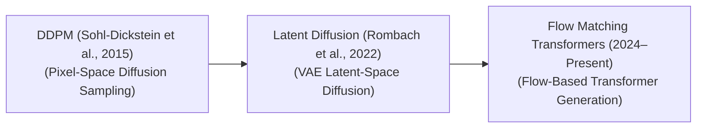

<!-- SEO: Diffusion Models, AI, Generative AI, Stable Diffusion, DiT, Flow Matching, DDPM, Sora, Midjourney, Machine Learning -->
# 🌟 Awesome-Diffusion-Models 🌟

## 🧠 Diffusion Models in AI: History, Progression, Variants, & Applications

Denoising Diffusion Models (also known as Diffusion Probabilistic Models) represent a dominant class of generative artificial intelligence architectures capable of synthesizing high-fidelity images, videos, audio waveforms, and molecular structures [INDEX: 4]. Mathematically, these models operate by framing data generation as the reverse of a progressive noise injection process [INDEX: 4]. 

During the forward pass, a dataset sample is systematically degraded into pure Gaussian noise over a series of chronological time-steps [INDEX: 4]. The diffusion model is then trained to predict and subtract this noise iteratively, mathematically mapping a chaotic noise distribution back into a clean, sharp data manifold [INDEX: 4].

---

## 📜 1. The Macro Chronological Evolution

The algorithmic progression of denoising diffusion models has transitioned from highly latent pixel-space math to compressed latent vectors, ordinary differential equation (ODE) straight lines, and scalable multi-modal transformers.

| Era | Description | Year | Paper |
| --- | --- | --- | --- |
| **[The Foundational Formulation Era (DDPM, Sohl-Dickstein et al., 2015 / Ho et al., 2020)](pages/DDPM.md)** | *Concept:* The structural baseline [INDEX: 4]. **Denoising Diffusion Probabilistic Models (DDPM)** formalized the discrete-time Markov chain framework. A convolutional **U-Net** backbone learned to predict the noise distribution added to raw image pixels at explicit time-steps [INDEX: 4].  *Limitation:* Catastrophically computationally expensive [INDEX: 4]. Generating a single image required running hundreds or thousands of sequential forward passes through the pixel-space U-Net, introducing immense processing latency [INDEX: 4]. | 2015 | [Sohl-Dickstein et al.](https://arxiv.org/abs/1503.03585) |
| **[The Latent Space Compression Era (Stable Diffusion, Rombach et al., 2022)](pages/LDM.md)** | *Concept:* Resolved the pixel-space latency crisis [INDEX: 4]. Instead of running the denoising loops on high-resolution pixels, **Latent Diffusion Models (LDMs)** use a Variational Autoencoder (VAE) to compress images into a highly dense, lower-dimensional latent space [INDEX: 4]. The U-Net then executes denoising steps over this compressed matrix [INDEX: 4].  *Significance:* Democratic access to generation [INDEX: 4]. It slashed the computational compute requirements, letting developers train and execute high-fidelity image synthesis on standard consumer-grade GPUs [INDEX: 4]. | 2022 | [Rombach et al.](https://arxiv.org/abs/2112.10752) |
| **[The Diffusion Transformer & Flow Matching Era (~2024–Present)](pages/DiT.md)** | *Concept:* The current modern state-of-the-art foundation standard [INDEX: 4]. Popularized by architectures like Stable Diffusion 3, Midjourney v6, and Black Forest Labs' **FLUX** series [INDEX: 4]. It completely discards convolutional U-Net architectures, replacing them with a scalable **Diffusion Transformer (DiT)** backbone [INDEX: 4]. Images are sliced into structural token patches, and the denoising path is optimized via straight-line **Flow Matching** ordinary differential equations (ODEs) [INDEX: 4]. | 2024 | [Peebles & Xie](https://arxiv.org/abs/2212.09748) |

---

## 🔬 2. Core Functional & Mathematical Variants

The Diffusion family tree features specialized mathematical core modifications designed to optimize sampling speed, manage probability paths, and enable non-Markovian generation.

| Variant | Description | Year | Paper |
| --- | --- | --- | --- |
| **[A. Denoising Diffusion Implicit Models (DDIM)](pages/DDIM.md)** | **Mechanism:** Generalizes DDPM into a non-Markovian deterministic trajectory [INDEX: 4]. Because the generation path follows fixed mathematical equations rather than stochastic random walks, it allows the model to skip time-steps during inference [INDEX: 4].  **Pros:** Drastically compresses generation latency, requiring only 20 to 50 steps to output crisp graphics instead of the 1,000 steps demanded by DDPM [INDEX: 4]. | 2020 | [Song, J., Meng, C., & Ermon, S.](https://arxiv.org/abs/2010.02502) |
| **[B. Score-Based Generative SDEs (Continuous Time)](pages/Score-SDE.md)** | **Mechanism:** Popularized by Song et al [INDEX: 4]. It models the forward and reverse diffusion pathways as continuous-time Stochastic Differential Equations (SDEs), utilizing score matching to estimate the gradient of the log-probability density of the data [INDEX: 4].  **Pros:** Provides a unified mathematical umbrella that links traditional diffusion models cleanly with score-based energy networks [INDEX: 4]. | 2020 | [Song, Y., et al.](https://arxiv.org/abs/2011.13456) |
| **[C. Flow Matching / Rectified Flow Models](pages/Flow-Matching.md)** | **Mechanism:** Replaces traditional curved Gaussian denoising trajectories with linear, straight ordinary differential equation (ODE) vector directions [INDEX: 4].  **Pros:** Vastly accelerates convergence speed, allowing high-fidelity, single-turn, or 4-step real-time generation when combined with consistency distillation [INDEX: 4]. | 2022 | [Lipman, Y., et al.](https://arxiv.org/abs/2210.02747) |

---

## ⚡ 3. Structural Sampling & Distillation Classes

To deploy diffusion models within interactive, low-latency commercial applications, specialized distillation layers compress the multi-step sampling loop.

| Class | Description | Year | Paper |
| --- | --- | --- | --- |
| **[Classifier-Free Guidance (CFG)](pages/CFG.md)** | *Profile:* Prompt conditioning multiplier [INDEX: 4]. During the denoising pass, the model calculates two parallel pathways: a text-conditioned prediction and an unconditioned prediction [INDEX: 4]. The system scales up the delta between them via a **CFG scale parameter**, letting developers dynamically tune how strictly the generation adheres to the prompt text versus creative variance [INDEX: 4]. | 2022 | [Ho & Salimans](https://arxiv.org/abs/2207.12598) |
| **[Latent Consistency Models (LCM) / Adversarial Distillation](pages/LCM.md)** | *Profile:* Step-collapsing distillation layers [INDEX: 4]. LCMs treat the continuous generation path as a consistency function, training a student network to predict the final, fully denoised latent vector at step zero in a single computational jump [INDEX: 4].  *Significance:* Unlocks high-volume, real-time interactive generation pipelines (1-step to 4-step sampling) for streaming live content [INDEX: 4]. | 2023 | [Luo et al.](https://arxiv.org/abs/2310.04378) |

---

## 🛠️ 4. Production Engineering Challenges & Hardware Solutions

Executing multi-step diffusion sampling loops across commercial cloud scales introduces severe memory-bus constraints and infrastructure processing bottlenecks.

| Challenge | Description | Year | Paper |
| --- | --- | --- | --- |
| **[The Transformer Sequence Length Wall (Megapixel Explosion)](pages/Megapixel.md)** | *The Problem:* When scaling up Diffusion Transformers (DiTs) to generate massive $1024 \times 1024$ megapixel outputs or continuous video streams, slicing the latent spaces into fine patches creates thousands of active tokens [INDEX: 4]. This causes the internal self-attention matrix calculation to hit a quadratic ($O(N^2)$) memory footprint wall, triggering cluster-wide VRAM crashes [INDEX: 4].  *Mitigation:* Implementing **FlashAttention hardware-aware register fusion**, coupled with **Grouped-Query Attention (GQA)** to compress the scale of the active cached attention matrices [INDEX: 4]. | 2022 | [Dao et al.](https://arxiv.org/abs/2205.14135) |
| **[The Fine-Grained Layout Control Deficit](pages/ControlNet.md)** | *The Problem:* Natural language text descriptions are inherently ambiguous [INDEX: 4]. Forcing a denoising loop to place an object at exact pixel locations or match a highly specific human posture using text prompts alone is highly inefficient [INDEX: 4].  *Mitigation:* Layering auxiliary adapter networks like **ControlNet** or **IP-Adapter**, which inject structural conditioning maps (Canny edges, depth maps, openpose skeletons, or image style vectors) directly into the frozen base model weights [INDEX: 4]. | 2023 | [Zhang et al.](https://arxiv.org/abs/2302.05543) |

---

## 🚀 5. Frontier Real-World AI Applications

| Application | Description | Year | Paper |
| --- | --- | --- | --- |
| **[Text-to-Image and Graphic Asset Foundation Engines](pages/Text2Img.md)** | *Application:* Powers commercial asset platforms (such as Midjourney, FLUX, Adobe Firefly) [INDEX: 4]. Hybrid CLIP/T5 text conditioning modules project user prompts into deep DiT cores, synthesizing high-resolution, photorealistic creative marketing, branding, and typography graphics natively [INDEX: 4]. | 2022 | [Rombach et al.](https://arxiv.org/abs/2112.10752) |
| **[Spatio-Temporal Physics Video Generation (Sora Class)](pages/Sora.md)** | *Application:* Drives next-generation automated pre-visualization and movie composition pipelines [INDEX: 4]. Video clips are tokenized into 3D spacetime cubes; the diffusion transformer removes noise across these cubes concurrently, predicting straight-line trajectories to generate physically consistent, fluid video relevance [INDEX: 4]. | 2024 | [Brooks et al.](https://openai.com/sora) |
| **[De Novo Molecular Docking and Protein Design (BioTech)](pages/BioTech.md)** | *Application:* Accelerates target-specific drug discovery and structural biology research [INDEX: 4]. Specialized SE(3)-equivariant diffusion models (such as AlphaFold 3 or RFdiffusion) treat molecular atomic coordinate fields as data clouds, denoising random initial spaces into stable, valid 3D protein backbones that satisfy explicit biochemical bonding rules [INDEX: 4]. | 2023 | [Watson et al.](https://www.nature.com/articles/s41586-023-06415-8) |

---

## 📚 References
1. Sohl-Dickstein, J., et al. (2015). Deep unsupervised learning using nonequilibrium thermodynamics. *International Conference on Machine Learning (ICML)*, 2256-2275 [INDEX: 4].
2. Ho, J., Jain, A., & Abbeel, P. (2020). Denoising diffusion probabilistic models. *Advances in Neural Information Processing Systems (NeurIPS)*, 33, 6840-6880 [INDEX: 4].
3. Song, J., Meng, C., & Ermon, S. (2020). Denoising diffusion implicit models. *arXiv preprint arXiv:2010.02502* [INDEX: 4].
4. Rombach, R., et al. (2022). High-resolution image synthesis with latent diffusion models. *Proceedings of the IEEE/CVF Conference on Computer Vision and Pattern Recognition (CVPR)*, 10684-10695 [INDEX: 4].
5. Peebles, W., & Xie, S. (2023). Scalable diffusion models with transformers. *Proceedings of the IEEE/CVF International Conference on Computer Vision (ICCV)*, 4165-4126 [INDEX: 4].
6. Lipman, Y., et al. (2023). Flow matching for generative modeling. *International Conference on Learning Representations (ICLR)* [INDEX: 4].

---

To advance this documentation repository, infrastructure workspace, or implementation setup, consider exploring these adjacent development pathways:
* Build a **Python code snippet using the Hugging Face `diffusers` library** illustrating how to load a Latent Diffusion Pipeline and pass custom image-to-image structural masks through an execution loop [INDEX: 4].
* Generate a **comprehensive Markdown table** explicitly analyzing standard DDPM, DDIM, Latent Diffusion (U-Net), and modern Diffusion Transformers (DiT) across structural loss components, GPU VRAM footprints, time-step complexities, and inference step thresholds [INDEX: 4].
* Establish a **performance evaluation suite using Triton** to profile exactly how compiling a Flow-Matching transformer's linear ordinary differential equation (ODE) sampling loop straight into GPU registers alters wall-clock processing throughput [INDEX: 4].

***

**Follow-Up Options Matrix:**

Before updating this documentation layout, let me know how you would like to proceed by choosing one of the options below:
* I can provide a **complete Python code boilerplate using PyTorch** demonstrating how to write a manual Gaussian noise prediction loop featuring a simplified U-Net layer from scratch [INDEX: 4].
* I can generate a **Markdown matrix table** analyzing the training and inference scaling parameters of the leading open-weight image generation backbones [INDEX: 4].

