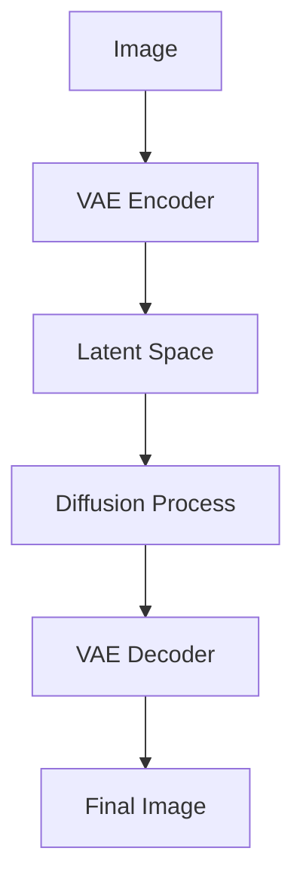

# Latent Diffusion Models

Detailed info on LDMs.

```mermaid
graph TD;
 A[Image] --> B[VAE Encoder];
 B --> C[Latent Space];
 C --> D[Diffusion Process];
 D --> E[VAE Decoder];
 E --> F[Final Image];
```